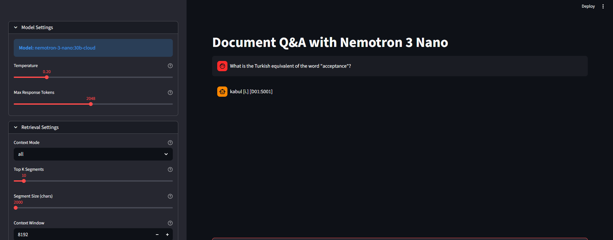
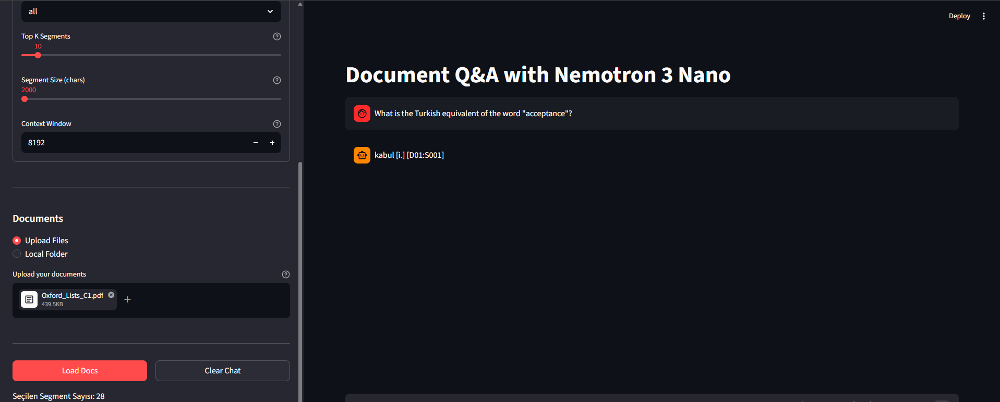

# 📄 Document Q&A with Nemotron 3 Nano

This project is a high-performance **RAG (Retrieval-Augmented Generation)** application that allows you to chat with your private documents using the **Nemotron 3 Nano (30B)** model via Ollama.

## 🚀 Features

* **Multi-Format Support:** Seamlessly process PDF, Markdown, TXT, JSON, YAML, and more.
* **Smart Retrieval:** Uses keyword-based scoring to select the most relevant document segments, optimizing context window usage.
* **Citation System:** The AI provides verifiable citations in `[Dxx:Syyy]` format (Document ID : Segment ID) for every claim.
* **Advanced Controls:** Fine-tune Temperature, Max Tokens, and Context Window size directly from the UI.
* **Flexible Ingestion:** Upload files directly or point the app to a local folder on your machine.

## 🛠️ Installation

1.  **Clone the Repository:**
    ```bash
    git clone [https://github.com/yourusername/nemotron-doc-qa.git](https://github.com/yourusername/nemotron-doc-qa.git)
    cd nemotron-doc-qa
    ```

2.  **Install Dependencies:**
    ```bash
    pip install streamlit pymupdf ollama python-dotenv
    ```

3.  **Setup Environment Variables:**
    Create a `.env` file in the root directory and add your Ollama API key:
    ```env
    OLLAMA_API_KEY=your_actual_api_key_here
    ```

## 💻 Usage

Launch the application using Streamlit:
```bash
streamlit run app.py

<p align="center">
  
  
</p>